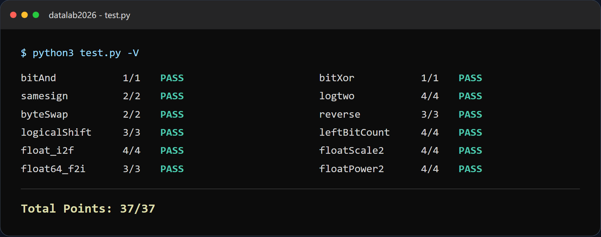
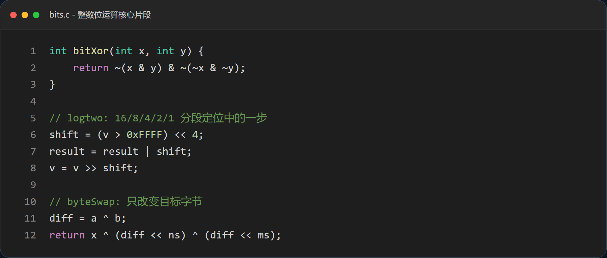
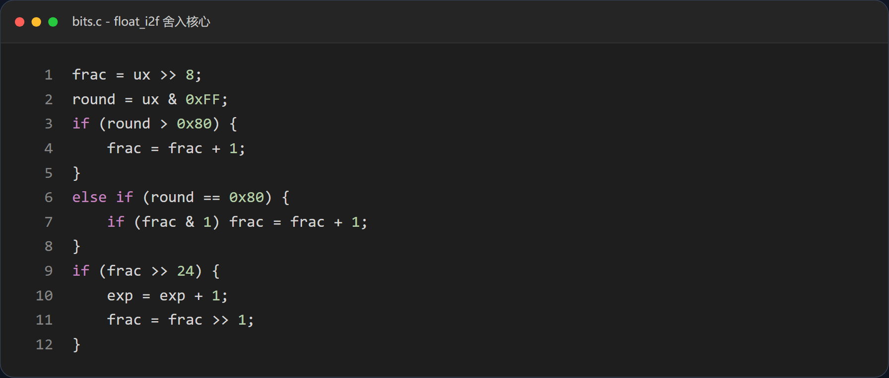

# Data Lab 实验报告

姓名：贲张翼  
学号：2025200682  
仓库：[hewsgeier935-art/datalab2026](https://github.com/hewsgeier935-art/datalab2026)

## 1. 实验结果

**结论：** 12 个函数全部通过正确性与合规性检查，总分为 **37/37**。实验中仅修改 `bits.c`，没有添加头文件或调试输出。

| 函数 | 得分 | 核心方法 |
| --- | ---: | --- |
| `bitAnd` | 1/1 | 德摩根定律 |
| `bitXor` | 1/1 | 分解“异号位” |
| `samesign` | 2/2 | 零值特判后比较符号位 |
| `logtwo` | 4/4 | 16/8/4/2/1 五步二分定位 |
| `byteSwap` | 2/2 | 字节差值的异或回填 |
| `reverse` | 3/3 | 逐位取出并反向追加 |
| `logicalShift` | 3/3 | 掩码清除算术右移的符号扩展 |
| `leftBitCount` | 4/4 | 分段跳跃定位第一个 0 |
| `float_i2f` | 4/4 | 规格化与 round-to-even |
| `floatScale2` | 4/4 | 按非规格化/规格化/特殊值分类 |
| `float64_f2i` | 3/3 | 拆分指数和尾数后对齐截断 |
| `floatPower2` | 4/4 | 指数范围分段构造 |

*图 1：根据仓库中的评测结果整理，所有测试点均通过。*

## 2. 解题报告

### 2.1 亮点

1. **`float_i2f`**：完整处理符号、规格化、尾数截断与“向偶数舍入”，边界最集中。
2. **`leftBitCount` / `logtwo`**：用固定步数的二分跳跃代替逐位扫描，思路简洁。
3. **`byteSwap`**：先求两字节的异或差值，再同时回填，避免构造复杂清零掩码。

### 2.2 基础布尔运算：`bitAnd` 与 `bitXor`

- `bitAnd` 直接使用德摩根定律：`x & y = ~(~x | ~y)`。
- `bitXor` 将结果理解为“两位不同”：既不能同时为 1，也不能同时为 0。因此在只允许 `~` 和 `&` 的条件下，可用两个“排除”条件相与。

### 2.3 符号与位置定位：`samesign`、`logtwo`、`leftBitCount`

**总体思路：** 先把问题转化为“找某个关键位”，再用符号位或分段右移完成定位。

- `samesign`：0 既不属于正数也不属于负数，所以先处理零；其余情况比较 `x >> 31` 与 `y >> 31`。
- `logtwo`：依次判断高 16、8、4、2 位区间，每次确定一部分结果并缩小搜索范围，最后得到最高位 1 的下标。
- `leftBitCount`：先取反将“前导 1 个数”转化为“前导 0 个数”，再以 16、8、4、2、1 为步长跳跃。`x = -1` 时需额外补足到 32。

*图 2：仅保留有助于说明思路的核心片段，其余重复步骤以注释省略。*

### 2.4 字节与位序变换：`byteSwap`、`reverse`、`logicalShift`

- `byteSwap`：先用 `n << 3` 和 `m << 3` 得到字节位移量，提取两字节后计算 `diff = a ^ b`。将 `diff` 分别移回两个位置并与原值异或，恰好可将两个字节同时改为对方。
- `reverse`：固定迭代 32 次，每次把输入的最低位追加到结果右端，然后输入右移。
- `logicalShift`：先执行算术右移，再与一个高位为 0 的掩码相与。掩码专门兼容 `n = 0`，避免移位 32 次引发未定义行为。

### 2.5 浮点位级处理：`float_i2f`、`floatScale2`、`float64_f2i`、`floatPower2`

**总体思路：** 分别处理符号、指数和尾数，并在正常值、非规格化值、无穷大及 NaN 之间明确分流。

#### `float_i2f`

1. 记录符号并得到绝对值；
2. 左移直到最高有效位到达 bit 31，同时修正指数；
3. 保留 23 位尾数，检查被截断的 8 位；
4. 大于半数时进位，恰好一半时仅在保留部分为奇数时进位，实现 round-to-even；
5. 处理舍入导致的尾数溢出，再组装符号位、指数和尾数。

*图 3：对截断位分为大于一半、等于一半和小于一半三种情况。*

#### 其余浮点函数

- `floatScale2`：NaN/无穷大原样返回；非规格化数将尾数左移；规格化数将指数加 1，若溢出则转为无穷大。
- `float64_f2i`：从高 32 位取 11 位指数和高位尾数，恢复隐藏的前导 1，再根据 `e = exp - 1023` 移位对齐。`e < 0` 返回 0，`e > 30` 返回溢出标记。
- `floatPower2`：将 `x` 分成过小、非规格化、规格化和溢出四个区间，直接构造 IEEE 754 位模式。

## 3. 关键边界与验证

| 场景 | 预期 | 实现中的处理 |
| --- | --- | --- |
| `samesign(0, 0)` | 1 | 零值单独分支 |
| `logicalShift(x, 0)` | 原值 | 不构造需要移位 32 次的表达式 |
| `leftBitCount(-1)` | 32 | 在分段统计后用 `!y` 补 1 |
| `float_i2f(INT_MIN)` | 正确的负数浮点表示 | 在无符号数上求补码绝对值 |
| 浮点截断部分恰好为一半 | 向偶数舍入 | 仅当保留部分最低位为 1 时进位 |
| `floatPower2(-149)` | 最小非零非规格化数 | `1 << (x + 149)` |
| `floatPower2(128)` | `+INF` | 返回 `0x7F800000` |

验证时同时关注了返回值、合法操作符、操作数上限和编译警告。最终评测结果为 37/37。

## 4. 收获与总结

这次实验最重要的收获是将“数值问题”转换为“位模式问题”。整数部分主要依赖布尔等价变换、掩码与二分定位；浮点部分则要先划分 IEEE 754 类别，再处理指数、尾数和舍入。对零、极值和临界舍入的单独检查，是比“只验证普通样例”更有价值的调试方法。

## 5. 参考的重要资料

1. 课程 Data Lab 仓库的 `README.md`：[https://github.com/RUCICS2026/datalab2026](https://github.com/RUCICS2026/datalab2026)
2. Randal E. Bryant, David R. O'Hallaron, *Computer Systems: A Programmer's Perspective*, Chapter 2：[http://csapp.cs.cmu.edu/3e/home.html](http://csapp.cs.cmu.edu/3e/home.html)
